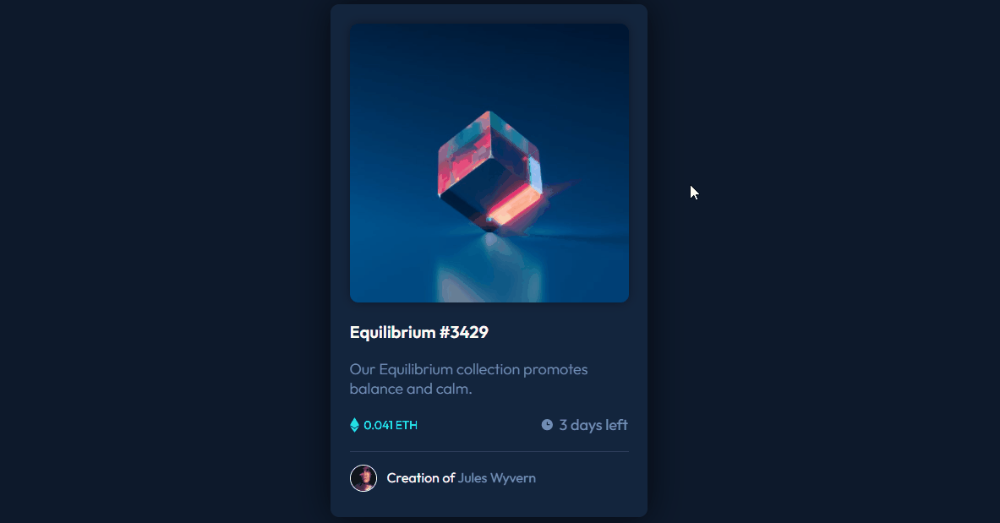

# Frontend Mentor - NFT preview card component solution

This is a solution to the [NFT preview card component challenge on Frontend Mentor](https://www.frontendmentor.io/challenges/nft-preview-card-component-SbdUL_w0U). Frontend Mentor challenges help you improve your coding skills by building realistic projects.

---

## Table of contents

- [Overview](#overview)
  - [The challenge](#the-challenge)
  - [Screenshot](#screenshot)
  - [Links](#links)
- [My process](#my-process)
  - [Built with](#built-with)
  - [What I learned](#what-i-learned)
  - [Continued development](#continued-development)
  - [Useful resources](#useful-resources)
- [Author](#author)

## Overview

### 🎯 The challenge

Users should be able to:

- View the optimal layout depending on their device's screen size
- See hover states for interactive elements

### Screenshot

### Links

- [My solution at Frontend Mentor](https://www.frontendmentor.io/solutions/nft-preview-card-component-lOH0rncEQ)

## 👩🏻‍💻 My process

- I started by rearranging my `index.html` file, adding semantic tags and visualizing the layout. I had the box-model concept in mind all along, and I thought I was organizing boxes inside of boxes.
- When I was satisfied with the organization, I moved on to styling with `css`. I started by organizing global variables and then I began styling box by box, until I had the complete layout and finished with the interactivity (hover property) and responsivity.

### 💻 Built with

- Semantic HTML5 markup
- CSS custom properties
- Flexbox
- CSS Grid

### 🏆 What I learned

- Positions with CSS
- Fade in Overlay with Icon
- Transitions

### 💪🏻 Continued development

- I want to keep practicing some CSS properties, such as Flexbox and Grid.

### 📚 Useful resources

- [W3Schools](https://www.w3schools.com/) - This helped me with some cool CSS properties and functionalities.
- [MDN Web Docs](https://developer.mozilla.org/en-US/docs/Web/CSS) - This helped me with some cool CSS properties and functionalities too. Always checking documentations to learn more 💪

## 👩🏻‍🦰 Author

- Frontend Mentor - [@tamiribeiro](https://www.frontendmentor.io/profile/tamiribeiro)
