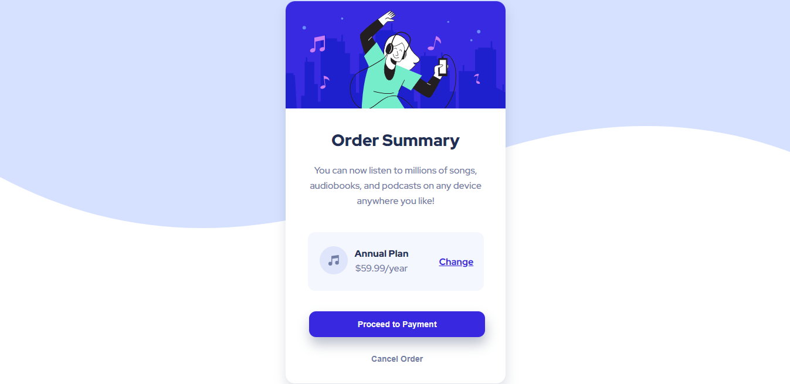

# Frontend Mentor - Order summary card solution

This is a solution to the [Order summary card challenge on Frontend Mentor](https://www.frontendmentor.io/challenges/order-summary-component-QlPmajDUj). Frontend Mentor challenges help you improve your coding skills by building realistic projects.

## Table of contents

- [Overview](#overview)
  - [The challenge](#the-challenge)
  - [Screenshot](#screenshot)
  - [Links](#links)
- [My process](#my-process)
  - [Built with](#built-with)
  - [What I learned](#what-i-learned)
  - [Continued development](#continued-development)
  - [Useful resources](#useful-resources)
- [Author](#author)

## Overview

### 🎯 The challenge

Users should be able to:

- See hover states for interactive elements
- View the optimal layout depending on their device's screen size

### Screenshot

### Links

- [My solution at Frontend Mentor](https://www.frontendmentor.io/solutions/order-summary-component-html-css-58Uu4PuKI)

## 👩🏻‍💻 My process

- I started by rearranging my `index.html` file, adding semantic tags and visualizing the layout. I had the box-model concept in mind all along, and I thought I was organizing boxes inside of boxes.
- When I was satisfied with the organization, I moved on to styling with `css`. I started by organizing global variables and then I began styling box by box, until I had the complete layout and finished with the interactivity (hover property) and responsivity.

### 💻 Built with

- Semantic HTML5 markup
- CSS custom properties
- Flexbox
- CSS Grid
- Mobile-first workflow

### 🏆 What I learned

- Positions with CSS
- Responsivity with media queries

### 💪🏻 Continued development

- I want to keep practicing responsivity with media queries and mobile-first workflow.

### 📚 Useful resources

- [W3Schools](https://www.w3schools.com/css/css_rwd_mediaqueries.asp) - This helped me understanding media queries.

## 👩🏻‍🦰 Author

- Frontend Mentor - [@tamiribeiro](https://www.frontendmentor.io/profile/tamiribeiro)
